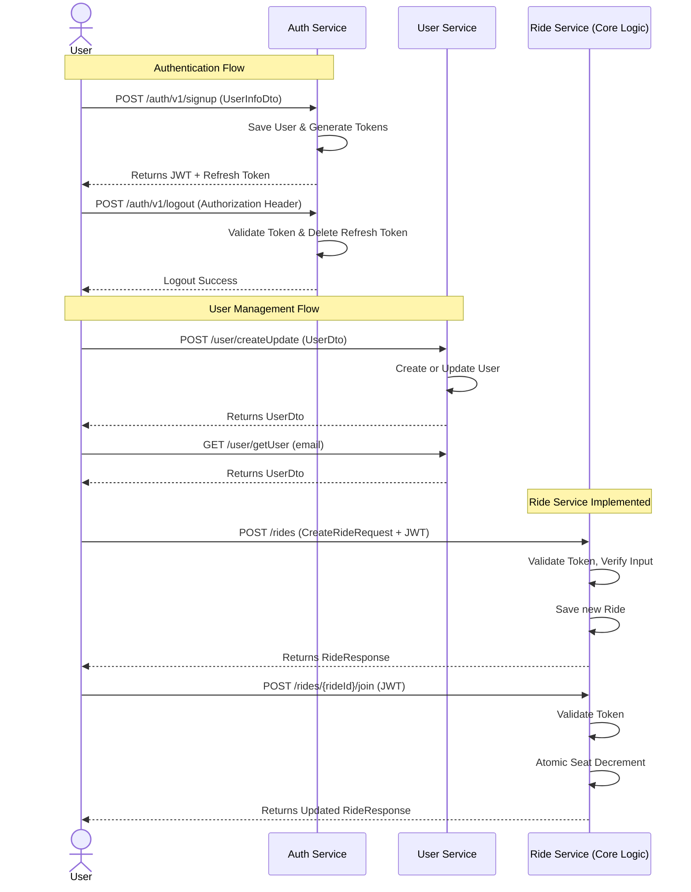

# Cabit – College Cab Pooling Platform (Backend)

Cabit is a campus-focused cab pooling platform designed to replace unstructured WhatsApp coordination used by college students for shared cab rides, especially on weekends and holidays.

Instead of manually posting messages in group chats, students can create and discover planned rides inside the app. Each ride contains destination, departure time, available seats, and total fare. Other students can join rides, and the system automatically manages seat availability and fare distribution.

The backend is built as a microservice-based system using Java Spring Boot, MySQL, and Kafka, with a strong focus on clean domain modeling, transactional consistency, and scalability. Authentication and user management are handled by separate reusable services. The Ride Service acts as the core domain service, managing ride creation, joining, leaving, and querying available rides.

The system is designed to:

- **Reduce coordination friction** for students
- **Prevent race conditions** when multiple users try to join the same ride
- **Support asynchronous events** (e.g., notifications, analytics) via Kafka
- **Scale cleanly** beyond a single campus in the future

This project prioritizes correct backend design, clear separation of concerns (controller–service–repository), and real-world engineering practices over rapid feature bloat.

## Tech Stack (Backend)

- **Java 17**
- **Spring Boot**
- **Spring Data JPA (Hibernate)**
- **MySQL**
- **Kafka** (event-driven architecture)
- **JWT-based Authentication** (external Auth Service)
- **Microservice architecture**

## System Flow (Current Status)

### Recent Improvements
- **Security:** Hardcoded secrets removed, JWT signature logic synchronized with Auth Service.
- **Concurrency:** Atomic SQL updates implemented in JPA repository to prevent race conditions during ride bookings.
- **Robustness:** Global Exception Handler added to gracefully handle custom exceptions (e.g., `RideServiceException`) and division-by-zero vulnerabilities mitigated.
- **Validation:** Enforced `@Valid` annotations to validate incoming DTOs before they hit the service layer.
