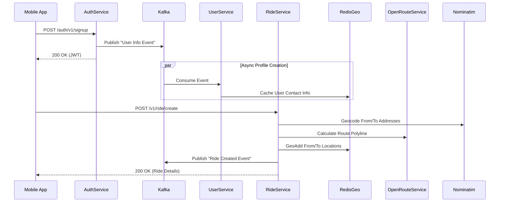

# Cabit - Ride-Sharing Microservices System

Welcome to **Cabit**, a robust, event-driven microservices architecture designed for a highly scalable ride-sharing platform. It handles secure user authentication, rich profile management, real-time geocoding, and ride placement using modern Java Spring Boot practices.

## 🚀 System Architecture

The system is split into four primary microservices: `auth-service`, `user-service`, `ride-service`, and `notification-service`, which are decoupled asynchronously via **Apache Kafka** and backed by **Redis** and **MySQL**.



## 🌟 Key Features

### 1. High Scalability

The system handles high traffic loads efficiently:

- **Stateless Authentication**: Uses **JWT (JSON Web Tokens)** with embedded user UUID claims, allowing the `auth-service` to scale horizontally.
- **Asynchronous Processing**: **Kafka** queues user profile mutations and ride creations, ensuring that critical workflows never block globally.
- **Blazing Fast Geospatial Searches**: **Redis** is natively used for caching user metrics and creating scalable, high-throughput geospatial indexes.

### 2. Deep Location Intelligence

- **Routing Integrated**: Direct integration with **OpenRouteService (ORS)** for drawing beautiful, accurate polylines on the map between point A and point B.
- **Geocoding**: Utilizes the **Nominatim** API to translate textual addresses (like "Vasant Kunj") precisely into latitude and longitude coordinates in India.
- **Near My Places**: Novel Redis Geo search functionality matches users looking for rides near any of their saved frequent physical locations.

### 3. Cross-Platform Mobile Experience

- **Unified Codebase**: Built with **React Native** and **Expo**, providing a native experience on both iOS and Android.
- **Interactive Maps**: Uses `react-native-maps` and `@mapbox/polyline` to give users an immersive view of their routes.

## 🛠️ Microservices & Frontend Overview

### A. Auth Service (`org.example`)

**Responsibility**: Authentication, Token Generation, Credential Storage.

- **Endpoints**: Handles `/auth/v1/signup`, `/auth/v1/login`, and `/auth/v1/logout`.
- **Producer**: Publishes user profile events to Kafka upon signup.
- **Security**: Embeds UUIDs deep into the token subject pool for accurate global downstream validation.

### B. User Service (`com.arnav.userService`)

**Responsibility**: Managing User Profiles (Address, Phone, Email) and syncing them globally.

- **Consumer**: Listens for user events to automatically provision profiles.
- **Integration**: Works seamlessly with Redis to keep a hot cache of names and phone numbers so that the `ride-service` doesn't have to wait on cross-service REST calls.

### C. Ride Service (`org.example`)

**Responsibility**: Core logistics, geocoding, and matchmaking.

- **Routing Engine**: Talks to external routing utilities (Nominatim, OpenRouteService) to assemble structured route objects.
- **Database**: Stores the primary ride entities and user relationship definitions in MySQL.
- **Redis Sync**: Duplicates the From and To latitudes of all active rides in Redis to allow users to ask "Who is going near me right now?" in sub-millisecond time.

### D. Notification Service (`org.example`)

**Responsibility**: Distributing events to downstream workers and mobile devices.

- **Consumer**: Silently watches the global Kafka broker to inform users of newly matched rides.

### E. Frontend (`frontend`)

**Responsibility**: Primary User Interface.

- **Stack**: React Native, Expo, Axios.
- **Routing**: Expo Router for file-based routing.
- **Feature Highlights**:
  - Fully integrated Map view mapping coordinates directly onto Google Maps instances.
  - Detailed Driver profiles pulled directly via the distributed cache overlay.

## 🔧 Technical Stack

- **Frontend**: React Native, Expo
- **Backend Language**: Java (Spring Boot)
- **Messaging**: Apache Kafka, ZooKeeper
- **Database**: MySQL
- **Caching & GeoSpatial**: Redis
- **Security**: Spring Security & JWT
- **External Dependencies**: Nominatim API, OpenRouteService API
- **Infrastructure**: Docker Compose

## 🏃‍♂️ Local Development Setup

### Running Locally

1.  **Start Backend Services**:

    **IMPORTANT**: You must use the `--build` flag to ensure the services are built from the local Dockerfiles.

    ```bash
    docker-compose up -d --build
    ```

    This command starts the entire microservices ecosystem: MySQL, Redis, Zookeeper, Kafka, Auth, User, Ride, and Notification services.

2.  **Start Frontend Application**:

    Navigate to the frontend directory and start the Expo server:

    ```bash
    cd frontend
    npm install
    npx expo start -c
    ```

    Scan the QR code with the Expo Go app (Android/iOS) or run on a simulator/emulator.

3.  **Troubleshooting Tips**:
    - **401/403 Errors**: Try logging out directly on the mobile app or deleting the `cabit_mysql_data` volume and restarting containers to flush stale Redis/MySQL relationships.
    - **Routing Failures**: Ensure the `openrouteservice.api.key` and `nominatim.api.url` settings are properly populated in your local property files.
