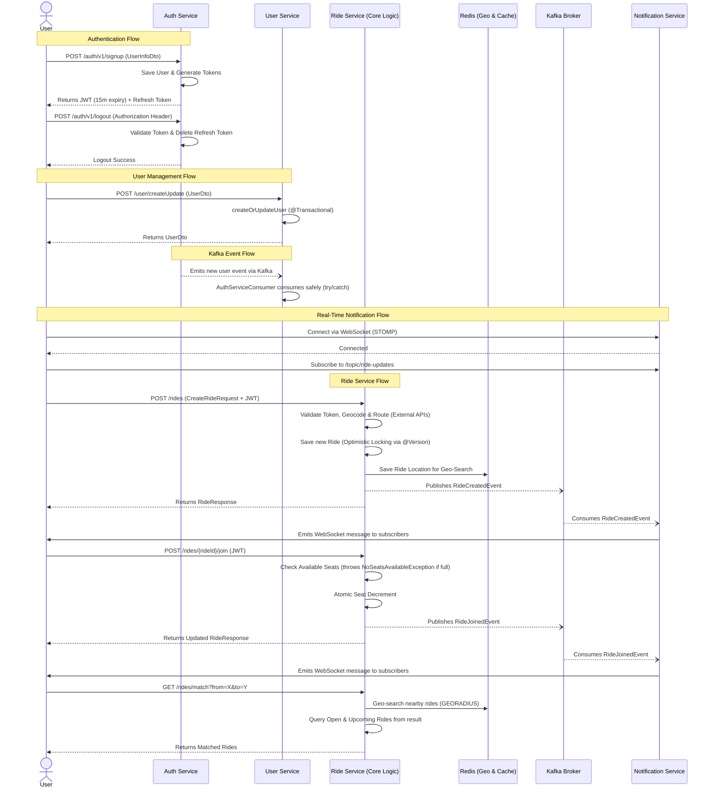

# Cabit – College Cab Pooling Platform (Backend)

Cabit is a campus-focused cab pooling platform designed to replace unstructured WhatsApp coordination used by college students for shared cab rides, especially on weekends and holidays.

Instead of manually posting messages in group chats, students can create and discover planned rides inside the app. Each ride contains destination, departure time, available seats, and total fare. Other students can join rides, and the system automatically manages seat availability and fare distribution.

The backend is built as a microservice-based system using Java Spring Boot, MySQL, and Kafka, with a strong focus on clean domain modeling, transactional consistency, and scalability. Authentication and user management are handled by separate reusable services. The Ride Service acts as the core domain service, managing ride creation, joining, leaving, and querying available rides.

The system is designed to:

- **Reduce coordination friction** for students
- **Prevent race conditions** when multiple users try to join the same ride
- **Support asynchronous events** (e.g., notifications, analytics) via Kafka
- **Scale cleanly** beyond a single campus in the future

This project prioritizes correct backend design, clear separation of concerns (controller–service–repository), and real-world engineering practices over rapid feature bloat.

## Tech Stack (Backend)

- **Java 17**
- **Spring Boot**
- **Spring Data JPA (Hibernate)**
- **MySQL**
- **Kafka** (event-driven architecture)
- **Redis** (Geospatial querying, caching)
- **WebSockets & STOMP** (real-time notification delivery)
- **JWT-based Authentication** (external Auth Service)
- **Microservices architecture** (Auth, User, Ride, Notification)

## System Flow (Current Status)



### Recent Improvements
- **Real-Time Notifications:** Integrated **Notification Service** using WebSocket and STOMP, driven by Kafka events (`RideCreatedEvent`, `RideJoinedEvent`, `RideLeftEvent`), to deliver instant updates to users.
- **Geospatial Queries & Caching:** Integrated **Redis** for performant geospatial queries (e.g., finding nearby rides via `RedisGeoService`) and caching.
- **Security:** Externalized JWT secrets to application.properties and drastically reduced token expiry time.
- **Microservices/Event-Driven:** Added Kafka Producer (`RideEventProducer`) in Ride Service to publish domain events decoupled from processing.
- **Concurrency:** Upgraded from just atomic SQL updates to full `@Version` Optimistic Locking in JPA for ride bookings.
- **Robustness:** Added try/catch safeguards to Kafka Consumers and added `@Transactional` integrity to User creation.
- **Exception Handling:** Replaced generic string-matching exceptions with strongly typed custom exceptions.
- **Architecture:** Externalized 3rd-party mapping API URLs for environment-specific deployment flexibility.

## Running Locally with Docker Compose

You can spin up the entire architecture (MySQL, Redis, Kafka using KRaft, Kong API Gateway, and all 4 microservices) effortlessly using Docker Compose.

1. First, build the Gradle artifacts for all microservices:
   ```bash
   ./gradlew clean build
   ```
2. Then, start the infrastructure and services:
   ```bash
   docker-compose up --build -d
   ```

This will build the Docker images (`authService-cabit`, `userService-cabit`, `rideService-cabit`, `notificationservice-cabit`) and start all dependencies.

