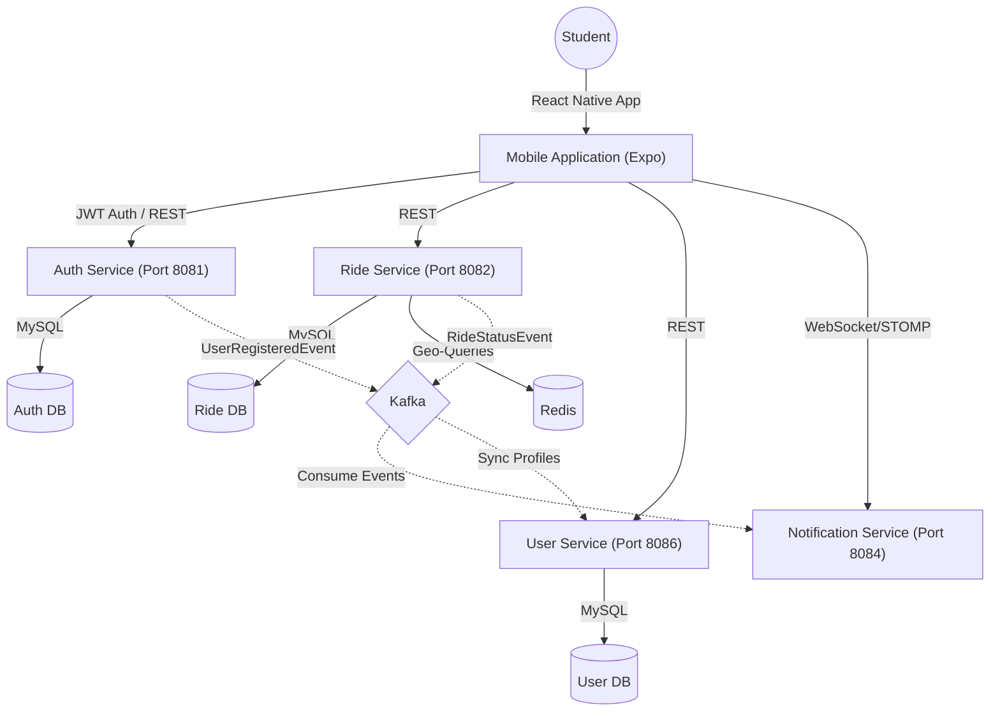

# Cabit – Campus Ride Pooling Platform

Cabit is a student-centric ride-pooling platform designed to eliminate the friction of coordinating shared travel (e.g., to airports, stations, or city centers) via messy WhatsApp groups. 

The platform consists of a **React Native (Expo)** mobile application and a **Spring Boot microservices** backend, communicating over REST and WebSockets, with Kafka for event-driven orchestration.

---

## 🏗️ System Architecture

Cabit follows a modern microservices architecture to ensure scalability and separation of concerns.



### Microservices Overview
- **Auth Service**: Handles registration, JWT issuance, and refresh token rotation with security-first practices (e.g., duplicate login protection).
- **Ride Service**: The core engine. Manages ride lifecycle (creation, joining, leaving), geospatial searching via Redis, and polyline route decoding.
- **User Service**: Manages synchronized user profiles and persistent student data.
- **Notification Service**: Delivers real-time updates (e.g., "A new seat was joined!") via WebSockets.

---

## ✨ Key Features

### 📱 Mobile Experience (React Native)
- **Interactive Map**: Visualize ride start/end points and encoded routes.
- **Dynamic Filtering**: Filter out your own rides from the global feed to focus on joining others.
- **Smart Refresh**: Screens automatically refresh using `useFocusEffect` when you switch tabs.
- **Native Pickers**: High-quality `DateTimePicker` implementation optimized for Android/iOS.
- **Auth Flow**: Secure JWT storage using `expo-secure-store` with automatic token refresh on 401 errors.

### ⚙️ Backend Logic
- **Geospatial Search**: Uses Redis `GEORADIUS` to find rides starting near a specific location.
- **Transactional Integrity**: Atomic seat increments/decrements with JPA optimistic locking.
- **Event Orchestration**: Kafka-driven synchronization between Auth and User services.
- **Concurrency Handling**: Specialized `EntityManager` flushing to prevent refresh token race conditions.

---

## 🚀 Getting Started

### 📦 Prerequisites
- **Java 17+** & **Gradle**
- **Node.js** & **npm**
- **Docker** & **Docker Compose**
- **Expo Go** app (on your phone)

### 🛠️ Manual Build (Backend)
```bash
# Build all jars
./gradlew clean build -x test
```

### 🐳 Running with Docker
```bash
# Spin up infrastructure and all services
docker-compose up --build -d
```

### 📱 Starting the App
```bash
cd frontend
npm install
# Set your Local IP in apiClient.js
npx expo start -c
```

---

## 🛠️ Tech Stack

**Frontend:** React Native, Expo, Axios, React Navigation, NativeWind (Tailwind), React Native Maps.  
**Backend:** Spring Boot, Spring Security (JWT), Spring Data JPA, Hibernate.  
**Data & Infra:** MySQL, Redis (Geo), Apache Kafka, Docker Compose.
